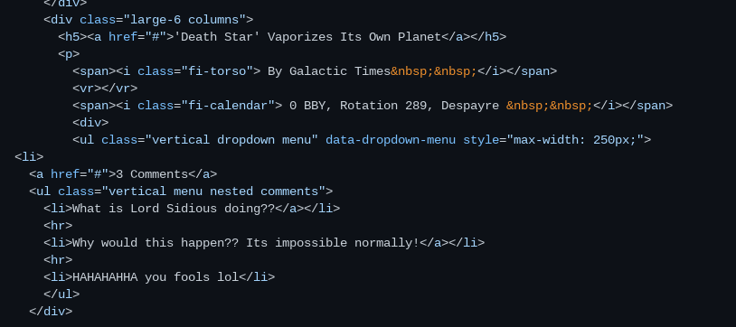
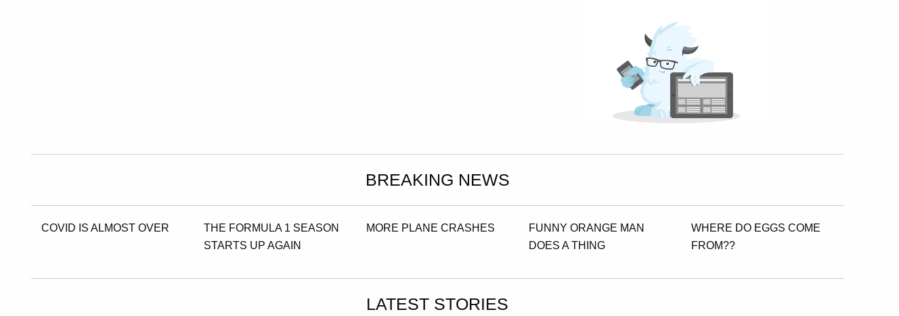
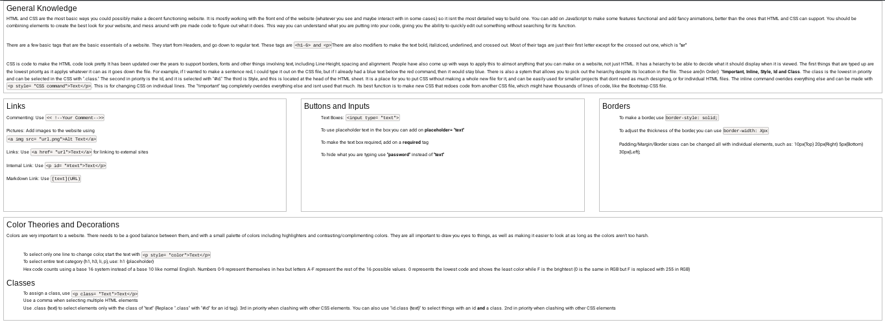

# Entry 5
##### 4/11/25

### What Have I Done So Far?
It has been at least a month since the last Blog entry and the majority of that time was spent learning the tool I am using to create my Freedom Project, which is [Foundation](https://get.foundation/). This is a framework that is oriented towards responsive navigation but still includes all the necessary elements. Since I had already learned Bootstrap, it was pretty easy to get used to Foundation because of how similar they are to each other. I originally tried to balance both at the same time, but I switched over to learning Foundation as much as I can. For example, I took a website template from the Foundation website and looked at its code, which helped me understand how it worked much better. Here is some code that I looked at and edited to figure out what elements did what:  

I also explored some of the Foundation grid, which can be seen here.  Each of the "Breaking News" Headlines has been made with a column. I played around with adding and lessening some headlines to see how the system worked, however I reversed it because I didn't like how it looked onscreen. There is a responsive tag that says `
`. As you can see above, there are 5 Breaking News columns and my Chromebook screen is at a large breakpoint. When this is shrunk down to a medium breakpoint, the amount of headlines goes down to 4, and then 3 at a small breakpoint. The headlines that don't fit get pushed down to a new line. As you can also see in the above picture, I was trying to add a logo into the site, which was taken from Foundations website. I was trying to put it on top of the "Breaking News" title but I think the image was too big and the space was too small. I also didn't know how to wrap text around it so there would've been a lot of dead space.

---

This is the same picture as my previous blog, but it is only one example. For the last week I have been making progress on making a website to put my SEP notes in, and that is a combination of Bootstrap and Foundation, which is also below: 
It does not look like a lot but it is using a Foundation element called `callout small` which are the boxes that you see on screen. I also used some Foundation breakpoints and Responsive tags which helped with the sizing and positioning quite a lot, but that is all backend stuff that people won't see. Since the majority of the homepage is made from Bootstrap (Which was made previous to this week), there isn't much I can talk about there, and most of the notes themselves are text and PrismJS. I have mostly been working on the Newspaper Template that is shown above and experimenting with different Foundation things such as the elements, sizes and responsiveness but I didn't really like what I made with them.

---

### Skills I Learned

One of the skills that I think I developed through this time was the ability to read the code, whether I made it or not. In one of my previous blogs or writeups I mentioned the fact that I found it kinda hard to read what was in front of me, especially with big blobs of text. Since those big blobs have gotten a lot more common, I think I got used to it and I figured out a way to pick out the stuff I want to find, using whatever resources I have like the indentations and (Ctrl-f).  This has made coding and editing pre made code a lot easier to do, and a lot faster as well since I don't have to slowly get through the code of a navbar. I also started putting "Headings" above sections of code and it makes things easier to find. For example, I would put `<!--Carosuel-->` to designate the Carousel from other code like the Navbar. 

I think I also figured out a way to efficiently look at what elements would do, and how I would customize them. When I first started learning frameworks, I found it hard and annoying to edit the properties of a card or whatever I am implementing into the page. After a few tutorials from the website and from Mr. Mueller, I figured out that you can edit the actual Framework file so that you can make it how you want or just simply add the new CSS class onto the file. You can also use the `<style>` part in the head of the HTML with the tag '!important` at the end of every line. That is the only way to get around the original CSS and it is important knowledge to have

[Previous](entry04.md) | [Next](entry06.md)

[Home](../README.md)
