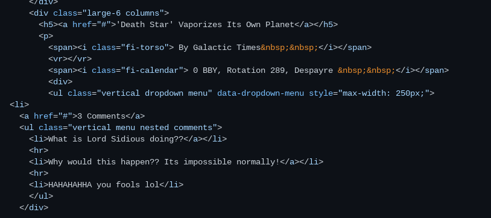
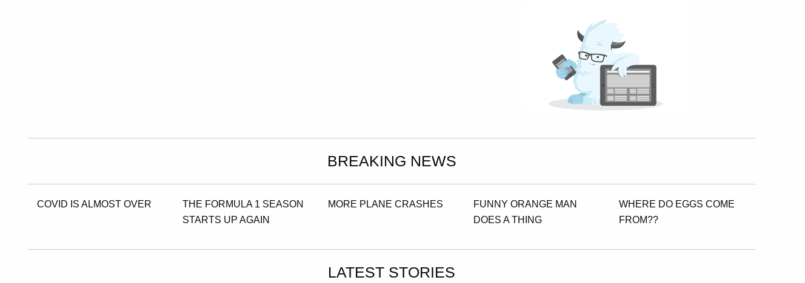

# Entry 5
##### 4/11/25

### What Have I Done So Far?
It has been at least a month since the last Blog entry and the majority of that time was spent learning the tool I am using to create my Freedom Project, which is [Foundation](https://get.foundation/). This is a framework that is oriented towards responsive navigation but still includes all the necesary elements. Since I had already learned Bootstrap, it was pretty easy to get used to Foundation because of how simalair they are to each other. I orginially tried to balance both at the same time, but I switched over to learning Foundation as much as I can. For example, I took a website template from the Foundation website and looked at its code, which helped me understand how it worked much better. Here is some code that I looked at and edited to figure out what elements did what:  

I also explored some of the Foundation grid, which can be seen here.  Each of the "Breaking News" Headlines has been made with a column. I played around with adding and lessening some headlines to see how the system worked, however I reversed it because I didnt like how it looked onscreen. There is a responsive tag that says `
`. As you can see above, there are 5 Breaking News columns and my Chromebook screen is at a large breakpoint. When this is shrunk down to a medium breakpoint, the amount of headlines goes down to 4, and then 3 at a small breakpoint. The headlines that dont fit get pushed down to a new line. As you can also see in the above picture, I was trying to add a logo into the site, which was taken from Foundations website. I was trying to put it on top of the "Breaking News" title but I think the image was too big and the space was too small. I also didnt know how to wrap text around it so there wouldve been a lot of dead space.

This is the same picture as my previous blog, but it is only one example. For the last week I have been making progress on making a website to put my SEP notes in, and that is a combination of Bootstrap and Foundation, which is also below: 
It does not look like a lot but it is using a Foundation element called `callout small` which are the boxes that you see on screen. I also used some Foundation 

[Previous](entry04.md) | [Next](entry06.md)

[Home](../README.md)
