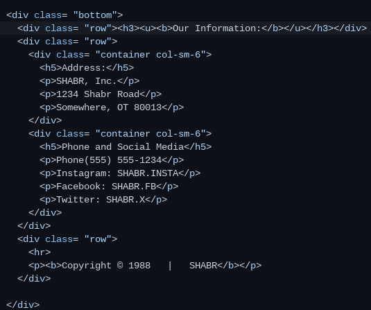

# Tool Learning Log

## Tool: **Foundation**

---

### 3/5/25:
* Messed around in the Newspaper website
* Tried to fix some parts on the website
* Tried to import Google Calendar but it might be a lot more tedious or just straight up impossible
* Played around with some menu and navbar options from the Docs page

### 3/10/24:
* Messed around in the Notes website
* I used both Foundation and Bootstrap elements
* Cards from Bootstrap

### 3/18/24:
* Learned How to open a new Terminal in IDE
* Messed around with some Nabar stuff from Bootstrap (Squeezing/expanding)
* Also tried to do colors
* Put buttons inside navbar instead of C&P

### 3/19/25:
* Tried to put the button on the right side but Mr Mueller said to do that later
* Added Dropdowns for information
* Getting the minimum stuff down, gonna do the CSS later

### 3/20/24
* Used Buttons groups instead of seperate dropdowns (Groups the dropdowns together in a row which was my issue before)
 `
`
 * Tried to fix workflow

### 3/24/24
 * Did some more responsive testing because im still not sure about it. I think Foundation makes it more understandable with its `small-up-3` tags. This allows for 3 columns on a small screen and up.
 * Tried to make a good footer and I saw Foundation might have decent templates I can try

### 3/25/25
* Tried a footer today, it was inspired by Abdels footer and his method of doing it

<!--
* Links you used today (websites, videos, etc)
* Things you tried, progress you made, etc
* Challenges, a-ha moments, etc
* Questions you still have
* What you're going to try next
-->
